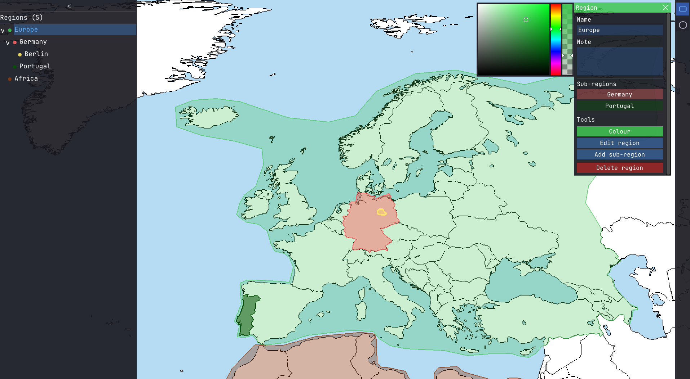
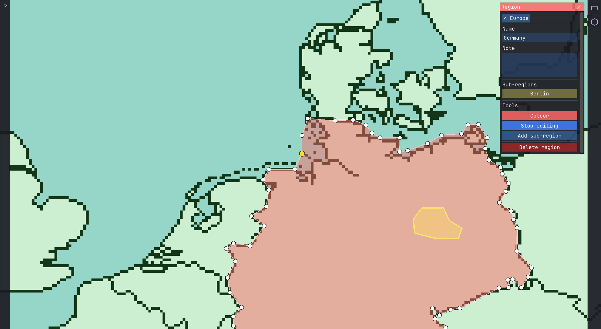

# Region Map Editor

A desktop application for drawing and organizing regions on top of a map image. Built in C++ with OpenGL.

---

## Screenshots

<p align="center">
  
  <br/>
  <em>Multiple regions and sub-regions with the region tree expanded</em>
</p>

<p align="center">
  
  <br/>
  <em>Edit mode with polygon handles visible and a sub-region inside the active region</em>
</p>


## Features

- **Pan & zoom** — middle-drag to pan, scroll to zoom toward cursor
- **Hover highlight** — the region under the cursor glows so you can see what a click will hit
- **Region drawing** — draw rectangular or polygon regions on the map
- **Hierarchical regions** — nest regions inside each other with drag-and-drop reparenting
- **Region search** — filter the region tree by name
- **Zoom to region** — double-click a region on the map or in the tree to zoom to it
- **Edit mode** — move polygon points and rectangle corners with precise handle dragging
- **Region metadata** — name and note fields per region, with colour picker
- **Visibility toggle** — hide/show regions and their children
- **Undo/redo** — up to 100 steps with Ctrl+Z / Ctrl+Y
- **Auto-save** — changes are saved automatically to `regions.json`

---

## Getting Started

### Prerequisites

- CMake 3.21+
- GCC (MinGW MSYS2 MINGW64 recommended on Windows)
- [vcpkg](https://github.com/microsoft/vcpkg) for dependency management

### Dependencies

| Library | Purpose |
|---|---|
| [GLFW3](https://www.glfw.org/) | Window creation and input |
| [ImGui](https://github.com/ocornut/imgui) | Immediate-mode UI (bundled in `external/`) |
| [nlohmann/json](https://github.com/nlohmann/json) | JSON serialization (bundled in `external/`) |
| [stb_image](https://github.com/nothings/stb) | PNG loading (bundled in `external/`) |

### Build

```bash
git clone https://github.com/alexanderdh1/region-map-editor.git
cd region-map-editor

# Install dependencies
vcpkg install glfw3

# Configure and build
cmake -B build
cmake --build build
```

### Assets

Place your map image at `assets/map.png` and a font at `assets/fonts/JetBrainsMono-Regular.ttf`.

Regions are saved to `regions.json` in the working directory.

To use block coordinate mode, place a metadata file at `assets/map.json`:

```json
{
  "minX": -2048,
  "minY": -2048,
  "maxX":  2048,
  "maxY":  2048
}
```

If no `.json` file is present, the application uses normalised image coordinates (0.0–1.0).

---

## Controls

| Input | Action |
|---|---|
| Middle-drag | Pan the map |
| Left-click | Select region under cursor |
| Double-click | Zoom to region under cursor |
| Scroll | Zoom toward cursor |
| `R` | Rectangle draw tool |
| `P` | Polygon draw tool |
| `Shift` + left-click | Place polygon point / start rectangle |
| `E` | Enter / exit edit mode |
| `C` | Open / close colour picker |
| `B` | Navigate back in region hierarchy |
| `S` | Save manually |
| `Ctrl+Z` | Undo |
| `Ctrl+Y` / `Ctrl+Shift+Z` | Redo |
| `Delete` | Delete selected region or polygon point |
| `Escape` | Cancel drawing / exit edit mode / close popup |

---

## Architecture

The system is divided into six modules with strict separation of concerns:

| Module | Responsibility |
|---|---|
| **Core** | Central coordinator — owns application state and update loop |
| **Data** | Region tree, geometry, serialization, world loading |
| **Input** | Translates raw mouse/keyboard events into actions for Core |
| **Rendering** | Stateless — draws current state using OpenGL fixed-function pipeline |
| **UI** | ImGui panels — communicates user actions to Core, never modifies state directly |
| **Window** | GLFW window setup, OpenGL initialization, and event callbacks |

Cross-module communication flows exclusively through Core. Rendering and UI are read-only consumers of state.

See [`docs/architecture.md`](docs/architecture.md) and [`docs/software-choice.md`](docs/software-choice.md) for full design documentation.

---

## License

MIT
